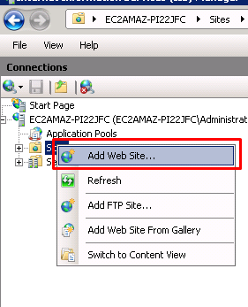
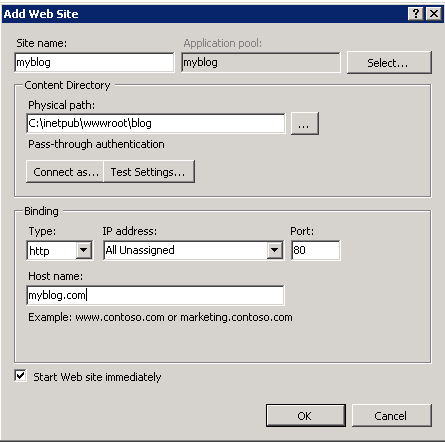
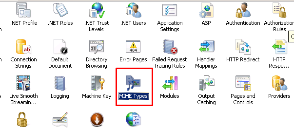
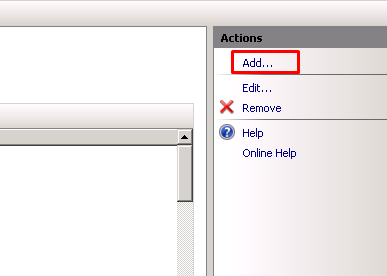
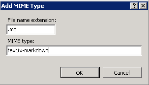

Set up MDwiki on IIS Server
===================

About
------

This walkthrough will describe how to setup MDwiki and get it running on [IIS](http://iis.com).  We also assume you have a fresh windows server setup with IIS installed.

Instructions
-------------

### Get MDwiki

Obtain MDwiki from http://mdwiki.info, you can either fork and build your own, or download the precompiled release.

The precompiled release comes with a couple different version of mdwiki.html file, feel free to use whatever one you want, but for this walkthrough we'll be using the ``mdwiki.html``.

 1. Copy ``mdwiki.html`` to a new folder where you want your website.  The standard IIS spot would be ``C:\inetpub\wwwwroot\your-website\`` but any path will work.  For this walkthrough we'll use ``C:\inetpub\wwwroot\blog\``

 2. Create two blank files.  The first being ``navigation.md`` and the second being ``config.json``.

  The ``navigation.md`` will be used for for the navbar that appears on the top of your website, and the ``config.json`` file will be used for additional configuration within your site.  For simplicity we will just leave these blank, we are creating them because at the time of writing (v0.5.8) they are required for your site to work.  Feel free to customize them in any way you like.

 3. Create a file named ``index.md``.  This will be the first markdown file that your site will show.  Customize it however you want.

For this demo we'll use this code

**index.md**

```
My MDwiki Website
----------------

###Hello World!
```

Place these three newely created files into the folder you created in step one. (``C:\inetpub\wwwroot\blog`` in our case).

Your directory should now look like this

    blog\
        mdwiki.html
        navigation.md
        config.json
        index.md

###Adding your website to IIS

Within your IIS Manager in the left pane, right click sites and choose ``Add New Website...``



In the Add New Website dialog, fill in your settings, if you're following along with the walkthrough they would look something like this (replace myblog.com with whatever your hostname is, or leave it blank to use the default server address)



###Setting up the Markdown MIME Type

If your IIS is a on a fresh windows install you will notice your website doesn't work quite yet.  That's because IIS out of the box doesn't know what to do with markdown (.md) files.  To fix this, select your website in the Sites dropdown, and Click on **MIME Types**



Once your the MIME Types section is opened, click on ``Add..`` in the upper right.



In the Add MIME type dialog give the file extension ``.md``, with a MIME type of ``text/x-markdown`` like the picture below.



After clicking the OK button IIS will now know how to serve markdown files to MDwiki. 

Navigate to your site to see it up and running.

Customize and Enjoy!
